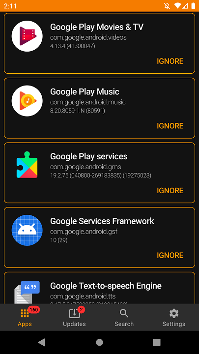
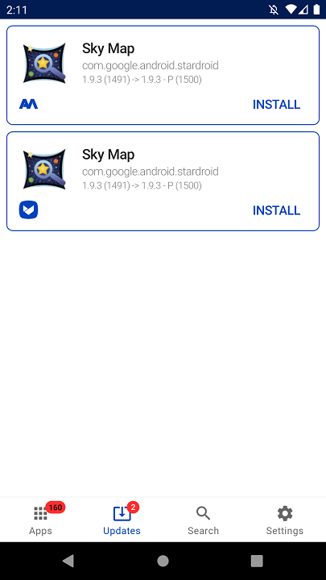

# APK Updater

[](https://github.com/KetanDutt/APK-Updater/actions/workflows/build.yml)
[](https://www.gnu.org/licenses/gpl-3.0)

**APK Updater** is a lightweight, privacy-respecting Android app that finds and installs updates for apps installed from any source. It checks multiple repositories at once, lists everything that has a newer version, and installs the APK with one tap — no store account, no tracking, no telemetry.

<p align="center">
  
  
</p>

## Features

- **Multi-source update checking** — F-Droid, Aptoide, APKMirror, APKPure and Google Play (via Aurora Store's anonymous token API) are checked in parallel and the results are merged.
- **Search** — look up any app in all enabled sources at once (search results include a direct install action).
- **Scheduled checks** — an optional background alarm re-checks for updates (daily / weekly / every 12 h / 6 h / 1 h) and posts a notification with the result.
- **Ignore list** — hide apps you don't care about from the check (per-app toggle).
- **Root install (optional)** — install silently with root privileges when the system installer is denied.
- **Self-update** — the app can check for newer releases of itself and install them directly (see [Releasing](#releasing)).
- **Six Material themes** (dark/light × blue/orange/green) that apply to both the classic views and the Jetpack Compose Apps tab.
- **Architecture & API level filters** — skip variants that don't match your device (CPU arch, minimum SDK, experimental builds).
- **Privacy-first** — no analytics, no crash reporting, no accounts. Only package names (and, for Aptoide, the SHA-1 of your install signature, which Aptoide's API requires) are sent to the repositories you enable. Cleartext traffic is disabled except for the single HTTP-only endpoint the Google Play source needs. See [Privacy](docs/PRIVACY.md).

## Installation

- **F-Droid:** [`com.rtctek.apkupdater`](https://f-droid.org/packages/com.rtctek.apkupdater/) (if available in your repository).
- **Releases:** grab the latest APK from the [GitHub Releases](https://github.com/KetanDutt/APK-Updater/releases) page.
- **Self-update:** once installed, the app checks the [release manifest](version.json) once a day and offers to install a newer build when one is published.

> **Note:** to install APKs manually, Android will ask you to allow "Install unknown apps" for the app that launches the installer. This is a system requirement.

## Usage

| Tab | What it does |
|---|---|
| **Apps** | Lists your installed apps (with version + code). Tap **IGNORE** / **UNIGNORE** to exclude an app from update checks. Pull to refresh to re-check. |
| **Updates** | Apps with a newer version available, grouped by nothing and sorted by name. **INSTALL** downloads and opens the system installer (or installs silently if root install is enabled). |
| **Search** | Queries all enabled sources for an app name; install the first result directly. |
| **Settings** | Choose which sources to check, the check schedule, theme, filters (architecture / minimum API / experimental builds) and the root install option. The **Developer** section links to this repository, the original project and the license. |

### Scheduled update checks

When a schedule is selected in **Settings → Updates → Check for updates**, an inexact repeating alarm runs the check in the background and shows a notification ("N updates found" / "No updates found"). On Android 8+ the check runs with the 60-second extended broadcast window; on Android 13+ granting the **Post notifications** permission is required for the result to be visible.

## Building

Requirements: JDK 11, Android SDK 33.

```bash
./gradlew build          # assembles debug + release APKs
./gradlew assembleDebug  # debug APK only
```

APKs land in `app/build/outputs/apk/`. The GitHub Actions workflow ([`.github/workflows/build.yml`](.github/workflows/build.yml)) builds on every push/PR and uploads the APKs as artifacts.

### Release signing

Release builds are signed with the debug key by default so CI always produces an installable APK. To sign with an upload key, add the following to `local.properties` (never commit this file):

```properties
keystore.file=/absolute/path/to/upload-keystore.jks
keystore.password=...
keystore.keyalias=...
keystore.keypassword=...
```

Keystore files are git-ignored (`*.jks`, `*.keystore`).

### Releasing

The self-update feature reads [version.json](version.json) from the `main` branch, so a release consists of:

1. Bump `versionCode` / `versionName` in `app/build.gradle`.
2. Build a signed release APK.
3. Create a GitHub release **tagged with the version name** (e.g. `2.1.0`) and attach the APK as an asset named `app-release.apk`.
4. Update `version.json` on `main`: `version` (new versionCode), `changelog`, and the `apk` URL pointing at the release asset.

Existing installs will offer the new version on their next daily check.

## Project layout

```
app/src/main/java/com/rtctek/apkupdater/
├── activity/           # MainActivity (navigation, badges, permissions)
├── application/        # Koin setup
├── di/                 # Koin module wiring
├── fragment/           # Apps (Compose), Updates, Search, Settings screens
├── model/              # UI models + API response models (apkmirror/apkpure/aptoide/fdroid/selfupdate)
├── receiver/           # AlarmReceiver (scheduled checks), BootReceiver
├── repository/         # One checker/searcher per source + orchestrators
│   ├── apkmirror/      # APKMirror (authenticated JSON API)
│   ├── apkpure/        # APKPure (HTML scraping)
│   ├── aptoide/        # Aptoide (JSON API)
│   ├── fdroid/         # F-Droid (index-v1.jar)
│   └── googleplay/     # Google Play via Aurora Store's anonymous token flow
├── ui/                 # Jetpack Compose widgets
├── util/               # Install helper, notifications, alarms, prefs, extensions
└── viewmodel/          # MVVM view models
```

A deeper walkthrough, including the thread model and the fault-isolation strategy, is in [`docs/ARCHITECTURE.md`](docs/ARCHITECTURE.md).

## Documentation

- [Architecture](docs/ARCHITECTURE.md) — how the pieces fit together
- [Contributing](docs/CONTRIBUTING.md) — build setup, code style, release process
- [Privacy](docs/PRIVACY.md) — exactly what data leaves your device, and to whom
- [Changelog](docs/CHANGELOG.md) — release history

## License & credits

GPL v3 — see [LICENSE](LICENSE).

- Forked from and heavily modified from [rumboalla/apkupdater](https://github.com/rumboalla/apkupdater).
- The Google Play source uses the vendored, GPL-licensed [Aurora Store](https://github.com/AuroraOSS/AuroraStore) library (`util/aurora/`).
- HTTP requests use a pinned fork of [kittinunf/fuel](https://github.com/rumboalla/fuel) (JitPack).
